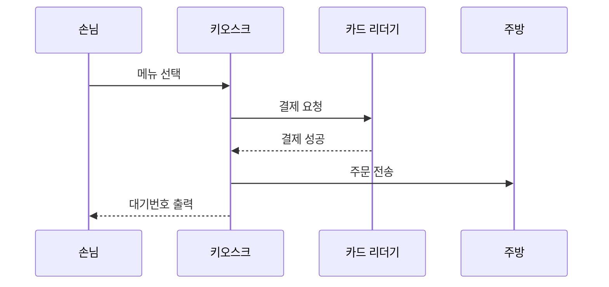

# 주제 : 분식집 키오스크 주문에 대한 시퀀스 다이어그램

일상 속의 주제로 분식집에 들어가서 키오스크를 통한 주문 결제 시스템을 구성해보았습니다. 
아래는 시퀀스 다이어그램입니다. 

```mermaid
sequenceDiagram
    participant 손님
    participant 키오스크
    participant 카드 리더기
    participant 주방

    손님->>키오스크: 메뉴 선택
    키오스크->>카드 리더기: 결제 요청
    카드 리더기-->>키오스크: 결제 성공
    키오스크->>주방: 주문 전송
    키오스크-->>손님: 대기번호 출력
```

