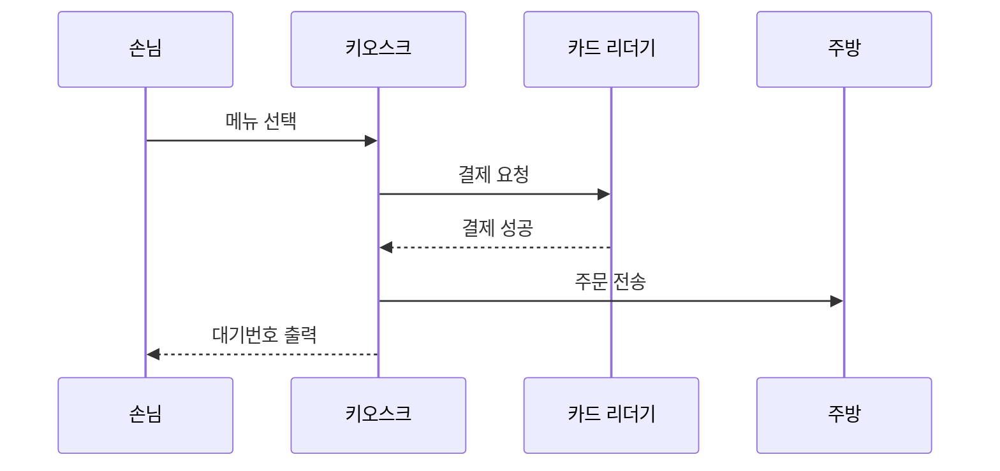

# 주제 : 분식집 키오스크 주문에 대한 시퀀스 다이어그램

  
일상 속의 주제로 분식집에 들어가서 키오스크를 통한 주문 결제 시스템을 구성해보았습니다.  

아래는 시퀀스 다이어그램입니다. 

설명 : 분식집에 손님이 들어옵니다. 키오스크를 통해 원하는 메뉴를 주문합니다. 카드 리더기에서는 결제 처리를 합니다. 결제가 완성되면 주방으로 주문을 전송합니다. 마지막으로 손님에게 대기번호를 출력합니다. 

예시 코드는 kiosk_order.py 파일에 작성되어 있으며,
Python으로 구현한 키오스크 주문 시뮬레이션 코드입니다.  

코드 설명 : 이 코드는 파이썬으로 작성되었고, 손님이 키오스크를 통해 주문 후 결제를 하면 주문이 주방으로 전송되고, 대기번호가 손님에게 출력되는 과정을 담고 있습니다.   
kiosk 클래스는 각각 기능을 수행하는 클래스들의 흐름을 통합합니다. (사용자의 입력을 받으면 클래스들을 순서대로 실행할 수 있게 합니다.) 손님이 ’떡볶이‘ 메뉴를 주문하면 출력 결과는 아래와 같습니다.   

[키오스크] '떡볶이' 메뉴를 선택하셨습니다!  

[카드 리더기] '떡볶이' 결제 요청 받았습니다...  

[카드 리더기] 결제가 완료되었습니다.  

[주방] '떡볶이' 주문을 접수했습니다. 맛있게 만드는 중입니다!  

[키오스크] 주문이 완료되었습니다. 대기번호는 15번입니다. 잠시만 기다려주세요 :)

      
## 모듈 평가

응집도: 각 클래스는 한 가지 역할을 수행하고 있어 응집도가 높습니다. 예를 들어, Order 클래스는 주문 정보를 담당, Pay 클래스는 결제를 담당, Kitchen 클래스는 주방에서 주문을 받는 것을 담당하고 있습니다. 

결합도: 클래스끼리 서로 호출은 하지만, 복잡하게 얽혀있지는 않아서 결합도는 낮은 편입니다. 각각의 기능이 따로 구현이 되어있어 유지보수하거나 수정이 쉬운 구조입니다. 
