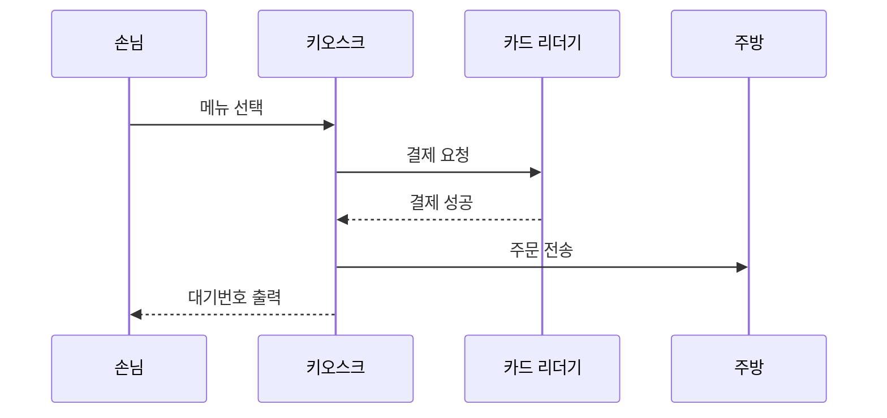

# 주제 : 분식집 키오스크 주문에 대한 시퀀스 다이어그램

일상 속의 주제로 분식집에 들어가서 키오스크를 통한 주문 결제 시스템을 구성해보았습니다.  

아래는 시퀀스 다이어그램입니다. 

설명 : 분식집에 손님이 들어옵니다. 키오스크를 통해 원하는 메뉴를 주문합니다. 카드 리더기에서는 결제 처리를 합니다. 결제가 완성되면 주방으로 주문을 전송합니다. 마지막으로 손님에게 대기번호를 출력합니다. 
